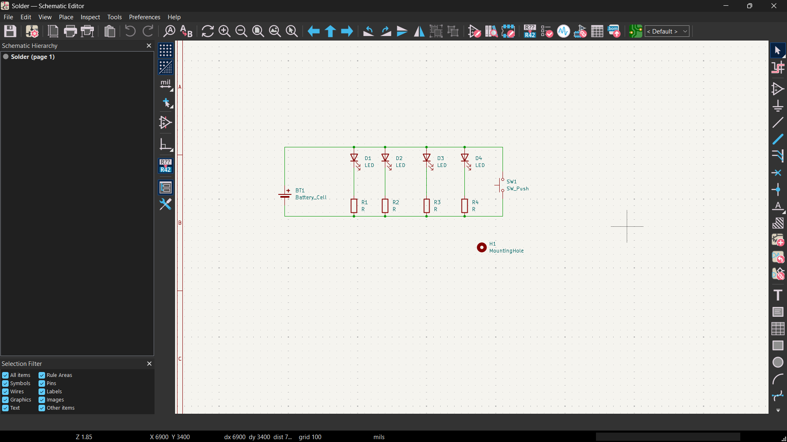
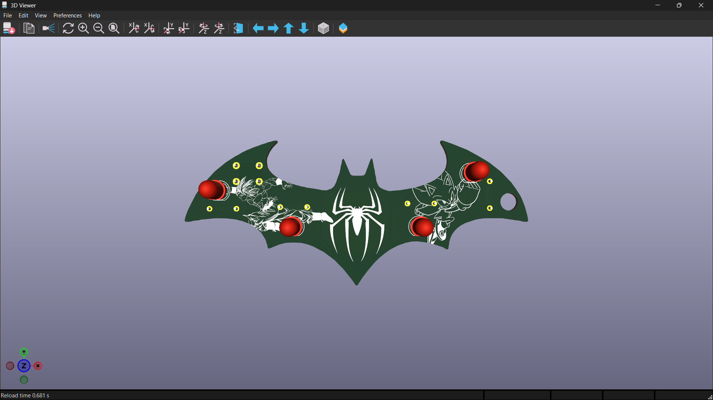
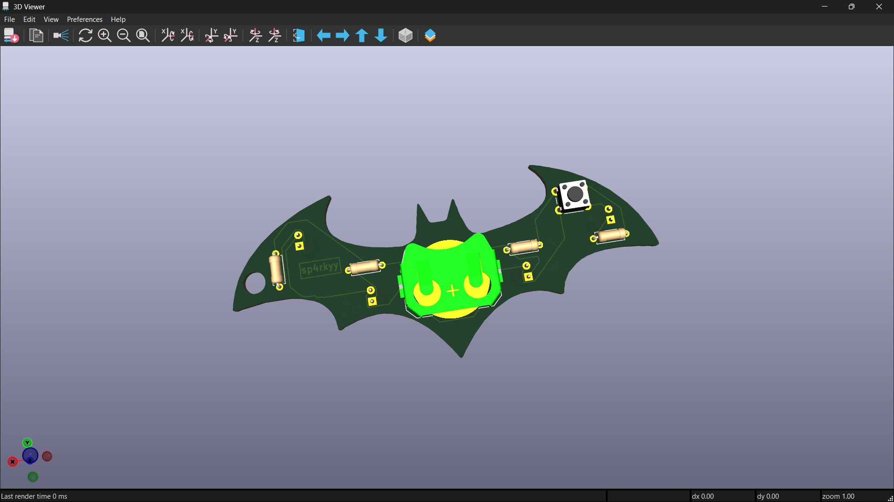
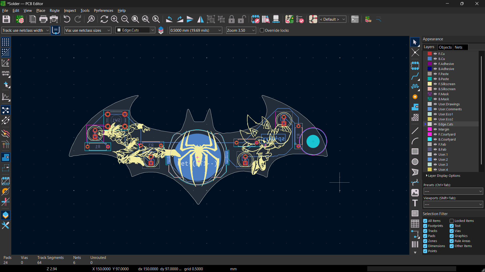

# CoolPCB

The main function of the PCB is that there is a button which will control the functioning of all the LEDs present in the board. 

## Schematic

## PCB

## How to build
Just order the PCB & components, open up the KiCAD file and build it accordingly.

## BOM
- 1 	Battery
- 4   LED
- 4	  470 Resistor
- 1 	Push Button

Made by Sushan!!

Made as a part of http://solder.hackclub.com/!
